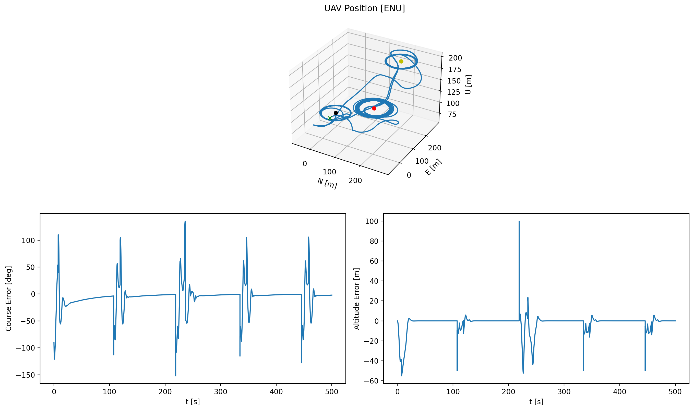

Name: Connor Guzikowski cguzikow@ucsc.edu
Name: Miguel Tamayo miatamay@ucsc.edu
Name: Bailen Lawson bjlawson@ucsc.edu

Run 'python FinalDemoGraph.py' while in the root directory (the one with all of the Chapter#.py files).
It will probably take a minute to run, but it will eventually.

When run, there will be a single plot window with three plots in it. The top plot
shows the ENU position of the UAV starting point (a green x), the positions of
three waypoints the UAV will fly around (red, yellow, and black in that order),
and the path the UAV flew during the simulation (the blue line). The bottom left
plot shows the course error over time and the bottom right plot shows the altitude
error over time.

The UAV is programmed to fly from it's origin to waypoint 1 (red dot), orbit it
for 100 seconds, then fly to waypoint 2 (yellow dot), orbit it for 100 seconds,
fly to waypoint 3 (black dot), orbit it for 100 seconds, then repeat. In the
error graphs, when there is a spike in the error, that indicates a transition
from orbiting a waypoint to moving to the next waypoint.

You can also run a verion of the GUI to see the UAV fly in the GUI:
Run 'python FinalDemoSim.py'

The GUI hack is not fully complete (in that the waypoints are not shown), but the
UAV path is correct. It shows the UAV flying to the waypoint, orbiting it, flying
to the next waypoint, etc.

At this point in the project, we have completed straight-line path following,
oriting, and the merging of the two via moving from waypoint to waypoint and
orbiting the waypoints for a set amount of time. Our logic for transitioning from
path following to orbiting is techically correct, but it is possible for the UAV
to miss the next waypoint if the radius is too small.

We still need to implement bezier curve path following, and possibly roll feed-
forward for the orbiting to make the UAV follow the orbit path more closely.